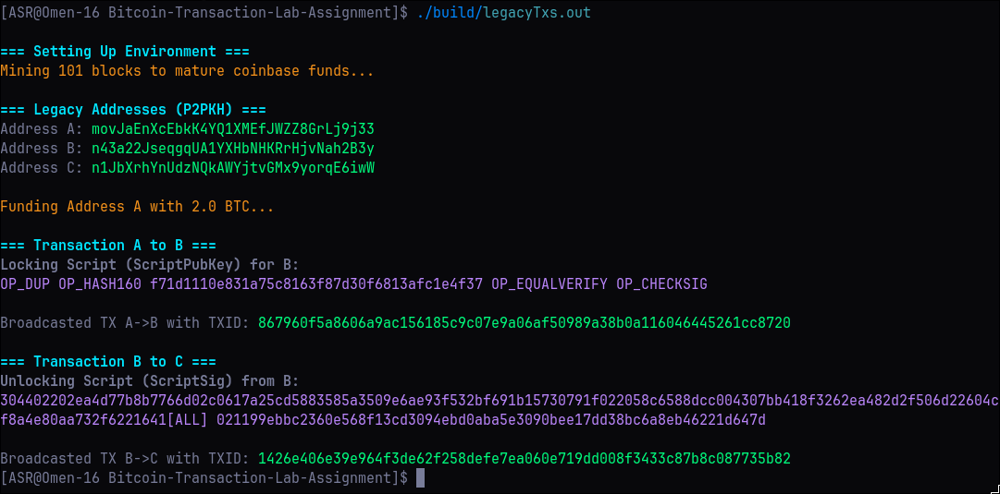
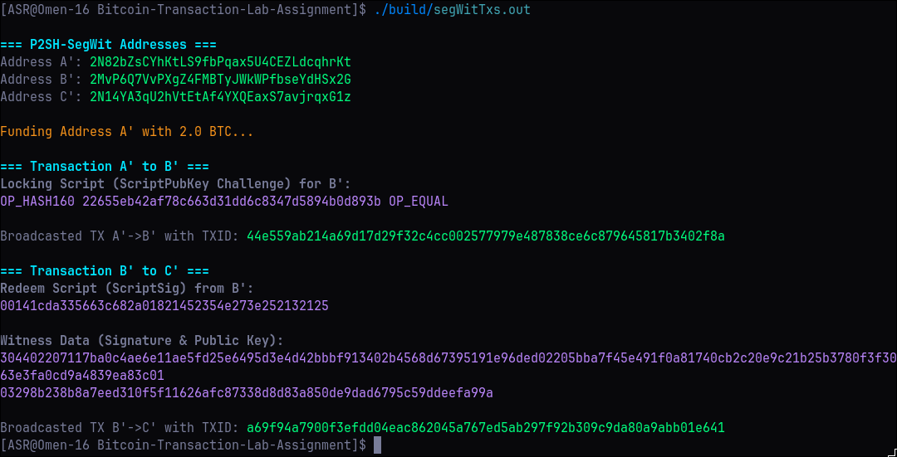
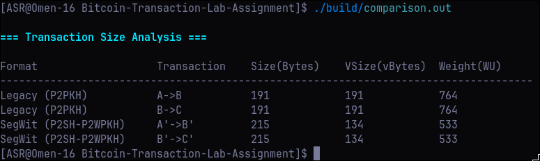

# CS 216: Bitcoin Transaction Lab Assignment

## Team Information
* **Arnav Kumar** - 240001013
* **Aryaman Awanish Tiwari** - 240001014
* **Ayush Singh Rana** - 240001015
* **Hrishabh Mittal** - 240001035

## Project Overview
This repository contains a C++ implementation for generating, signing, and broadcasting Bitcoin transactions on a local `regtest` network. It demonstrates the differences between Legacy (P2PKH) and SegWit (P2SH-P2WPKH) address formats, automating the extraction of locking/unlocking scripts and providing a data-driven comparison of transaction sizes (Bytes, vBytes, and Weight Units).

## Execution Output

Here are the terminal outputs for the successful execution of the three primary programs:

### Part 1: Legacy Transactions (P2PKH)


### Part 2: SegWit Transactions (P2SH-P2WPKH)


### Part 3: Size Analysis & Comparison


## Prerequisites
To run this project, ensure you have the following installed:
* **Docker & Docker Compose (or a local `bitcoind` installation):** To run the isolated `regtest` node.
* **C++20 Compiler (g++ or clang++):** For compiling the project.
* **Make:** For build automation.
* **libcurl:** Required for making HTTP POST requests to the Bitcoin RPC. 
* **btcdeb (Optional but recommended):** The Bitcoin Script Debugger, used for manual validation of the extracted transaction scripts.

> ⚠️ **Note on Windows:** Running this project natively on Windows is **highly discouraged** due to complex C++ dependency chains (like `libcurl` and OpenSSL) and OS-specific build environment quirks. Strongly recommend using **WSL2 (Windows Subsystem for Linux)** or a Linux VM. If you must build on native Windows, please skip to the [Windows Build & Execution Guide](#windows-build--execution-guide) at the bottom of this document. **Follow at your own risk**.

## How to Run the Code (Linux & macOS)

**1. Configure the Environment**
Copy the template environment file to create your active `.env` file. 
```bash
cp .env.example .env

```

**2. Start the Bitcoin Regtest Node**
You can run the node using either Docker Compose or a local `bitcoind` installation.

**Option A: Using Docker Compose (Recommended)**
Spin up the local Bitcoin daemon using Docker Compose. This automatically configures the network with the exact fee metrics required for the assignment.

```bash
docker compose up -d

```

**Option B: Using a Local `bitcoind` Installation**
If you prefer not to use Docker, you can run `bitcoind` locally. Ensure it is configured for `regtest` mode and that the parameters match the RPC credentials in your `.env` file. You can start it with a command similar to:

```bash
bitcoind -regtest -daemon -rpcuser=youruser -rpcpassword=yourpassword -rpcport=18443 -fallbackfee=0.0002

```

**3. Build the Project**
Use the provided Makefile command to compile all C++ binaries.

```bash
make all

```

*(Note: You can also use `make run` to build and immediately execute the entire pipeline).*

**4. Execute the Transactions**

**Option A: Run the Entire Pipeline Sequentially**
This command will run Part 1, Part 2, and the Part 3 comparison back-to-back.

```bash
make run

```

**Option B: Run Executables Individually**
If you prefer to run and analyze the parts one by one, you can execute the compiled binaries directly from the `build` directory.

```bash
./build/legacyTxs.out
./build/segWitTxs.out
./build/comparison.out

```

**5. Teardown**
Once finished, safely stop the daemon and clean up the compiled binaries.

```bash
# If using Docker:
docker compose down

# If using local bitcoind:
bitcoin-cli -regtest -rpcuser=youruser -rpcpassword=yourpassword -rpcport=18443 stop

# Clean up binaries
make clean

```

## Common Errors & Troubleshooting

If you encounter issues while running the executables, here are the most common errors and how to fix them:

**1. Connection Refused / Server Error**

```text
Exception caught: CURL request failed: Could not connect to server

```

* **Cause:** The C++ application cannot reach the Bitcoin RPC server. This usually means the node isn't running or the connection parameters are incorrect.
* **Solution:** Ensure that your Bitcoin regtest node is actively running (use `docker compose ps` to check if the container is up). Additionally, verify that the `RPC_IP` and `RPC_PORT` in your `.env` file exactly match your node's configuration (the default port is `18443`).

**2. Wallet Already Exists Error**

```text
Exception caught: RPC Error: {"code":-4,"message":"Wallet file verification failed. Failed to create database path '/home/bitcoin/.bitcoin/regtest/wallets/labWallet'. Database already exists."}

```

* **Cause:** The script attempts to create a wallet named `labWallet` via RPC, but a wallet with this name was already created during a previous execution.
* **Solution:** The C++ script safely wraps the wallet creation in a `try...catch` block, so **the program will catch this exception and continue executing normally** using the existing wallet. However, if you want a completely clean slate to avoid this message, you must wipe the node's data:
* **If using Docker:** Run `docker compose down -v` to safely destroy the container and its attached data volumes, then run `docker compose up -d` to start fresh.
* **If using local `bitcoind`:** Stop the daemon, delete the `regtest` folder inside your `.bitcoin` data directory, and restart the node.


## Repository Structure & File Descriptions

### Source Code (`src/`)

* **`legacyTxs.cpp`**: Executes Part 1. Generates Legacy (P2PKH) addresses, funds them, creates a transaction chain (A -> B -> C), and logs the size metrics to a CSV.
* **`segWitTxs.cpp`**: Executes Part 2. Performs the exact same workflow as Part 1, but utilizes P2SH-SegWit addresses (A' -> B' -> C') to demonstrate modern transaction structures.
* **`comparison.cpp`**: Executes Part 3. Parses the generated metrics CSV and outputs a formatted table comparing the sizes, vSizes, and weights, alongside an analytical conclusion.
* **`BitcoinRpcClient.cpp`**: The core implementation of the RAII-compliant HTTP client used to interface with the `bitcoind` JSON-RPC API via `libcurl`.

### Headers (`include/`)

* **`BitcoinRpcClient.hpp`**: Header definition for the RPC client.
* **`DotEnv.hpp`**: A lightweight, custom single-header utility to parse the `.env` file and load configuration parameters dynamically.
* **`json.hpp`**: The `nlohmann/json` library used for serializing and deserializing the JSON-RPC payloads.

### Configuration & Tooling

* **`docker-compose.yml`**: Container orchestration file that deploys `ruimarinho/bitcoin-core:latest` in `regtest` mode with hardcoded network fee parameters.
* **`Makefile`**: Automates the compilation of the shared object files and distinct binaries, ensuring smooth execution.
* **`.env.example`**: .env template.

---

## Windows Build & Execution Guide

If you absolutely must run this project natively on Windows rather than via WSL2, you will need a proper MinGW-w64 toolchain installed and configured in your System `PATH`.

**0. Install the Toolchain (MSYS2)**
The most robust way to get the correct Windows toolchain is through [MSYS2](https://www.msys2.org/). 
1. Download and install MSYS2.
2. Open the **MSYS2 UCRT64** terminal from your Start Menu.
3. Run the following `pacman` commands to install the C++ compiler, Make, and the `libcurl` dependencies:

```bash
# Update the package database and base packages
pacman -Syu

# Install g++, mingw32-make, and libcurl for the UCRT64 environment
pacman -S mingw-w64-ucrt-x86_64-gcc mingw-w64-ucrt-x86_64-make mingw-w64-ucrt-x86_64-curl

```

> **CRITICAL STEP:** After installation, you must add the binaries folder (usually `C:\msys64\ucrt64\bin`) to your Windows System `PATH` environment variable. Once added, completely restart your PowerShell, Command Prompt, or VS Code terminal before proceeding.

**1. Build the Project**
Windows uses `mingw32-make` instead of standard `make`. Our Makefile includes a specialized Windows routine that automatically resolves and copies required MinGW DLLs (like `libcurl-4.dll`, `libcrypto-3-x64.dll`, etc.) directly into the `build/` folder to prevent "Exit Code 1" or "STATUS_DLL_NOT_FOUND" crashes.

Open PowerShell or Command Prompt and run:

```powershell
mingw32-make all

```

**2. Execute the Transactions**

**Option A: Run the Entire Pipeline Sequentially**

```powershell
mingw32-make run

```

**Option B: Run Executables Individually**
If you prefer to run and analyze the parts one by one, you must execute the `.exe` files from the `build` directory:

```powershell
.\build\legacyTxs.exe
.\build\segWitTxs.exe
.\build\comparison.exe

```

**3. Cleanup**

```powershell
mingw32-make clean

```